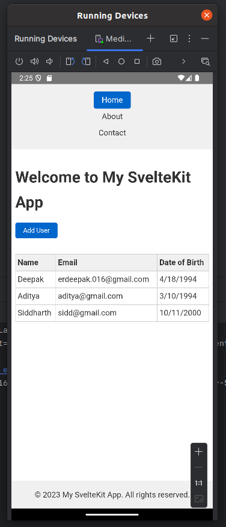
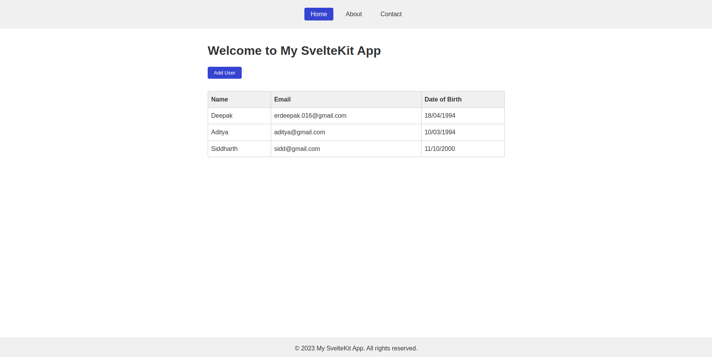

# SvelteKit + Capacitor Project

This project is a basic example of a SvelteKit app integrated with Capacitor for native mobile platform support. The backend is powered by a simple Express server.

## Table of Contents

- [Getting Started](#getting-started)
- [Installation](#installation)
- [Development](#development)
- [Backend Setup](#backend-setup)
- [Building for Production](#building-for-production)
- [Capacitor Commands](#capacitor-commands)
- [Useful Links](#useful-links)

## Getting Started

This project allows you to run a SvelteKit web app and build it into a native mobile app using Capacitor. Capacitor enables web applications to run natively on iOS and Android platforms.

## Installation

To get started with this project, you will need to have Node.js installed. If you haven't already, download and install it from [here](https://nodejs.org).

Clone the repository and install the required dependencies:

```bash
git clone https://github.com/NashTech-Labs/sveltkit-capacitor-template.git
cd sveltekit-capacitor-template
cd template-sveltekit-capacitor
npm install
```

This will install all required packages, including SvelteKit and Capacitor.

## Development

To run the SvelteKit application in development mode, use the following command:

```bash
npm run dev
```

This will start the development server, and you can view your app in the browser at http://localhost:5173.

## Backend Setup

1. Navigate to the server directory:

```bash
cd ../server
```

2. Install dependencies for the Express server:

```bash
npm install
```

3. Create a `.env` file in the backend root:

```makefile
MONGODB_URI=<your_mongo_db_connection_string>
PORT=3000
```

4. Start the Express server:

```bash
npm run start
```

## Building for Production

To build the SvelteKit app for production, use the `build` script:

```bash
npm run build
```

This will output the static files for your app in the `build` directory.

### Building the Capacitor app for Android/iOS

After building the app for production, you can use Capacitor to generate native Android or iOS projects. Follow the steps below:

1. **Add a plateform:**

   For Android:

   ```bash
   npx cap add android
   ```

   For iOS:

   ```bash
   npx cap add ios
   ```

2. **Sync your app with Capacitor:**

   ```bash
   npx cap sync
   ```

3. **Open the platform in Android Studio or Xcode:**

   For Android:

   ```bash
   npx cap open android
   ```

   For iOS:

   ```bash
   npx cap open ios
   ```

## Capacitor Commands

Here are some useful Capacitor commands:

- `npx cap sync` - Syncs the web app with native platforms.
- `npx cap open android` - Opens the Android project in Android Studio.
- `npx cap open ios` - Opens the iOS project in Xcode.
- `npx cap copy` - Copies the web assets to the native platforms.
- `npx cap run` - Runs the native project (Android/iOS).

## Useful Links

- [SvelteKit Documentation](https://kit.svelte.dev/docs/introduction)
- [Capacitor Documentation](https://capacitorjs.com/docs)
- [Vite Documentation](https://vite.dev/guide/)

## Mobile app


## Desktop View
